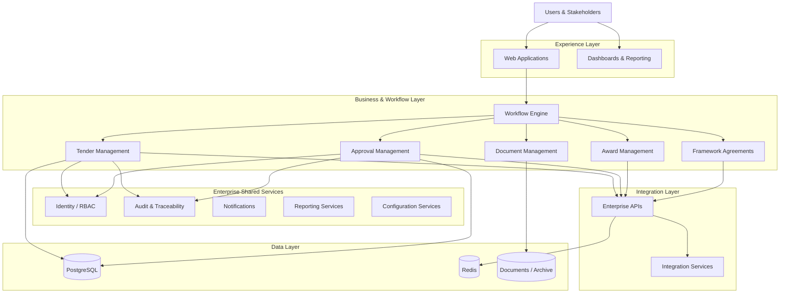
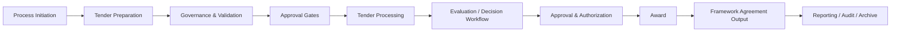
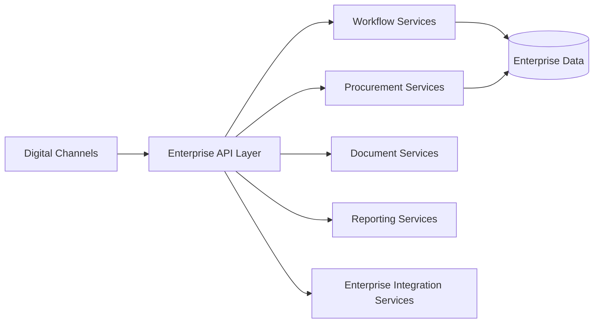
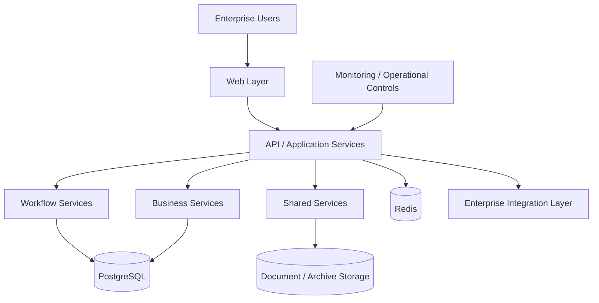

# Enterprise E-Tender & Procurement Platform

> A sanitized enterprise architecture case study based on a real large-scale electronic tender and procurement platform.

## Overview

The Enterprise E-Tender Platform is an end-to-end digital procurement solution designed to govern complex tender and procurement processes through structured workflows, role-based controls, approvals, traceability, and controlled outputs.

The platform digitizes the procurement lifecycle through:

- 10 linked end-to-end process steps
- 30 operational stages
- 15 Chairman approval points
- 20+ governed roles and permission groups
- Segregation of Duties (SoD)
- Workflow gates and approval controls
- Full process traceability
- Controlled award and framework-agreement outputs

**Procurement is not simply a sequence of screens — it is a governed enterprise workflow.**

## Architecture Principles

- Separation of presentation, business, integration, and data layers
- API-driven communication
- Modular business capabilities
- Configurable workflow orchestration
- Role-Based Access Control (RBAC)
- Segregation of Duties
- Centralized document handling
- Auditability and traceability
- Data governance
- Integration readiness
- Security by design
- Performance, resilience, and business continuity

## High-Level Architecture



## Core Modules

### Tender Management
- Tender lifecycle management
- Process state management
- Workflow transitions
- Controlled user actions
- Tender documentation
- Governance rules

### Workflow & Approval Engine
The operational model includes 10 linked process steps, 30 operational stages, and 15 Chairman approval points. Workflow gates control state transitions and enforce formal approval chains, accountability, governance, and traceability.

### Role & Permission Management
More than 20 governed roles and permission groups participate across the process.

```text
User → Role → Permission → Allowed Action → Workflow Gate → Business Operation
```

The model supports Segregation of Duties by preventing incompatible activities from being concentrated under a single operational role.

### Approval Management
- Multi-level approvals
- Approval gates
- Authorized decision points
- Controlled workflow transitions
- Approval traceability

### Document & Archive Management
- Document association with business processes
- Controlled access
- Document lifecycle management
- Archiving
- Traceability
- Governance

### Award Management
Award processing remains connected to workflow state, authorization, approval history, tender data, and audit information.

### Framework Agreement Management
Award outcomes can feed controlled framework-agreement outputs, preserving continuity between tender execution and subsequent procurement arrangements.

### Reporting & Executive Visibility
- Operational monitoring
- Process visibility
- Management reporting
- Executive oversight
- Workflow status tracking
- Procurement analytics

## End-to-End Workflow



The actual production process contains significantly more operational detail across the 30 governed stages. Those internal definitions are intentionally excluded.

## Roles & Governance

**Authentication → Role → Permission → Workflow State → Allowed Action**

Enterprise procurement authorization cannot rely on RBAC alone. An authorized user may have permission to perform an operation but still be prevented from executing it if the process has not reached the appropriate workflow state.

This creates two complementary controls:

1. Authorization Control
2. Process-State Control

## Integrations



Specific internal endpoints and proprietary integration details are intentionally excluded.

## Security Architecture

### Identity & Authorization
- Role-Based Access Control
- Controlled permissions
- Segregation of Duties
- Workflow-aware authorization

### Application Security
- Controlled business operations
- API-based service boundaries
- Validation of workflow transitions
- Restricted privileged operations

### Governance
- Approval controls
- Auditability and traceability
- Controlled process states
- Accountability across roles

### Data Protection
- Controlled access to procurement information
- Governed document access
- Separation of business responsibilities
- Audit records for critical actions

## Data Architecture

PostgreSQL provides the core relational data platform.

```text
Tender
 ├── Workflow State
 ├── Documents
 ├── Approvals
 ├── Roles / Permissions
 ├── Process Events
 ├── Award Information
 ├── Agreement Outputs
 └── Audit History
```

Redis supports appropriate caching and application performance patterns. Detailed production schemas are intentionally excluded.

## Technology Landscape

### Frontend
- ReactJS

### Backend & Services
- Node.js
- C# / .NET APIs

### Data
- PostgreSQL
- Redis

### Platform
- Docker
- Containerized workloads

### Integration
- Enterprise APIs
- Integration services

### Analytics
- Reporting platforms
- Executive dashboards

## Deployment Architecture



Docker-based containerization provides separation between application workloads and supports controlled deployment practices. Exact production topology, infrastructure configuration, network architecture, and internal environment details are intentionally excluded.

## SDLC & Delivery Governance

```text
Business Requirements
        ↓
Solution Architecture
        ↓
Engineering
        ↓
Testing / QA
        ↓
UAT
        ↓
Release Governance
        ↓
Deployment
        ↓
Adoption & Support
        ↓
Root Cause Analysis
        ↓
Continuous Improvement
```

## My Role

My involvement focused on enterprise workflow, procurement governance, architecture leadership, and technology delivery governance.

Responsibilities included:

- Enterprise architecture leadership
- Final technical and architecture decision ownership
- Translating procurement processes into governed digital workflows
- Technology organization leadership
- Architecture and integration governance
- Security and access-control governance
- SDLC governance
- Engineering oversight
- QA and UAT governance
- Release and deployment governance
- Production support oversight
- Root Cause Analysis
- Continuous improvement

The objective was not simply to digitize existing procurement activities, but to create a controlled enterprise platform where technology enforces process governance, accountability, and traceability.

## Architecture Outcomes

**Workflow + RBAC + Segregation of Duties + Approval Gates + APIs + Data Governance + Auditability**

## Confidentiality

This repository is a **sanitized architecture case study** based on real enterprise technology work.

It intentionally excludes:

- Source code
- Credentials
- Internal endpoints
- Infrastructure addresses
- Proprietary algorithms
- Production database schemas
- Internal network topology
- Confidential procurement information
- Organization-specific security configurations

Architecture diagrams are simplified representations created for professional portfolio and knowledge-sharing purposes.
